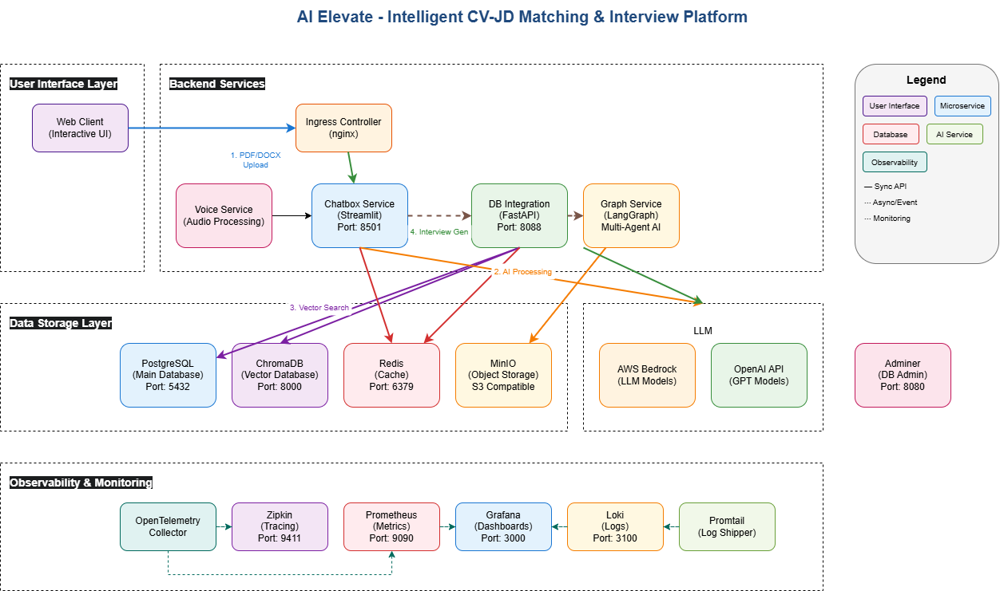

# AI Elevate

An Intelligent CV-JD Matching & Interview Platform.

AI Elevate is a comprehensive monorepo containing microservices for AI-powered recruitment solutions. The platform provides intelligent CV-JD matching, automated interview generation, and interactive chat capabilities using modern AI technologies.

## 1. Features

- **Smart CV-JD Matching**: Automatically match candidates' resumes with job descriptions using AI-powered analysis
- **Automated Interview Generation**: Generate relevant interview questions and real-time conversation with AI interviewer based on resume content and job requirements
- **Multi-Agent Architecture**: LangGraph-based workflow orchestration for complex AI tasks
- **Kubernetes Ready**: Complete Helm charts for production deployment
- **Observability**: OpenTelemetry integration with Zipkin tracing and Prometheus/Grafana monitoring

## 2. High-Level Architecture



## 3. Quick Start

### 3.1. Prerequisites

- Docker and Docker Compose
- Python 3.8+
- AWS credentials (for Bedrock access)
- OpenAI API key (for graph processing)

### 3.2. Local Development

1. **Clone the repository**:
   ```bash
   git clone https://github.com/AI-Elevate-Org/ai-elevate-monorepo.git
   cd ai-elevate-monorepo
   ```

2. **Set up environment variables**:
   ```bash
   # Create .env file in apps/graph/
   cp apps/graph/.env.example apps/graph/.env

   # Edit with your API keys and configurations
   ```

3. **Start infrastructure services**:
   ```bash
   cd compose
   docker compose up -d --build --remove-orphans
   ```

4. **Access services**:
   - **Chatbox**: http://localhost:8501
   - **DB Integration API**: http://localhost:8088
   - **Grafana**: http://localhost:3000
   - **Zipkin**: http://localhost:9411
   - **Adminer**: http://localhost:8080

### 3.3. Kubernetes

Use the provided Helm charts for Kubernetes with DEV environment:

```bash
cd kubernetes
./deploy-ai-elevate-dev.sh
```

## 4. API Documentation

### 4.1. Database Integration API

The FastAPI service provides comprehensive API documentation at:
- **Swagger UI**: http://localhost:8088/docs

## 5. Development

### 5.1. Adding New Services

1. Create service directory in `apps/`
2. Add Dockerfile and requirements
3. Update `docker-compose.yaml`
4. Create Kubernetes Helm chart
5. Add to deployment scripts

### 6. Testing

### 7. Monitoring and Observability

- **Traces**: View in Zipkin at http://localhost:9411
- **Metrics**: Prometheus at http://localhost:9090
- **Dashboards**: Grafana at http://localhost:3000
- **Logs**: Docker logs or Kubernetes logs

## 8. License

This project is for internal use only. All rights reserved.

---

Built with ❤️ by the AI Elevate team.
